# ExamenPaginaWEB
## Ejercicio 1
### 1A. Pregunta ¿Por qué NO se centra el texto del h1 en este caso? Explícalo con tus palabras. (por qué visual y estructuralmente no aparece centrado entre el borde izquierdo y el menú)
#### El titulo no queda centrado ya que flexbox reparte espacio entre bloques, no dentro del texto, y por tanto ese text align center solo centra el texto dentro de h1 no en cabecera.
### 1B. Ejercicio - Soluciona de dos formas diferentes
#### Con flex seria:

.site-header {
  display: flex;
  align-items: center;
}

.site-header h1 {
    flex:1; (Para que el h1 ocupe el espacio entero y por tanto este todo por igual y ya abajo lo centramos)
  text-align: center;
}
Y con grid:

.site-header {
  display: grid;
  grid-template-columns: auto auto auto; (Aqui creamos 3 columna ya que podemos observar que en la parte izquierda hay un menu desplegable y en la parte derecha el menu de navegacion, asi al hacer un grid column y el text align el texto quedara centrado)
  align-items: center;
}

.site-header h1 {
  grid-column: 2; (Aqui te coloca el titulo donde quieras ponerlo)
  text-align: center; (te alinea el texto)
}
### 1C. Ejercicio – Convertir la cabecera en dos filas
#### .site-header {
  display: grid;
  grid-template-columns: auto auto auto;
  grid-template-rows: auto auto auto;
  align-items: center;
  
}
h1 + nav {
    margin-top: 30px;
}
.site-header h1 {
  grid-column: 2;
  grid-row: 1;
  text-align: center;
  
}
h1 > nav {
    margin-top: 30px;
}
.main-nav {
    
  grid-row: 2;
  grid-column:2;
  text-align: center;
  list-style: none;
}
.main-nav ul {
  list-style: none;
}
### 1D. Ejercicio - Dar relieve y separacioón visual al header
#### .site-header {
  display: grid;
  grid-template-columns: auto auto auto;
  grid-template-rows: auto auto auto;
  align-items: center;
  background-color: gray;
  border-bottom: solid black;
}
## Ejercicio 2 — Reorganización del header con tres elementos

## Ejercicio 3 — Miniaturas, zoom y enlace a la imagen original
### 3A. Crear miniaturas
#### Yo ya lo hice con un generador para que todas esten echas de igual tamaño e igual anchura, se tendria que hacer lo mismo pero con un ancho de 200 px por ejemplo.
### 3B. Efecto hover
#### Con el box shadow con un generador de sombras se pone la sombra por detras, luego con un border solid black le pongo bordes y con transform scale (1.03) le pongo un mini ZOOM
## Ejercicio 4 - Informe de evidencias del proyecto (defensa técnica simple)
### 4.1. Introduccion
- El tema de mi WEB es acerca de motos.
- He incluido la Historia general del motociclismo, seguido de unas miniaturas de motos de diferentes tipos con su respectiva tabla de cada modelo con sus especificaciones y caracteristicas y terminando con un formulario para mas informacion y informacion para ponerse a contacto conmigo.
- Mi idea de diseño era que transmita ganas de leerlo una vez visualizandolo, con colores no muy llamativos pero sin quitarle esencia.
### 4.2. Evidencias de HTML5
- En el header se muestra en primer lugar un "h1" que es para el tirulo y luego su main con "ul seguido de li" que es para hacer una lista desordenada
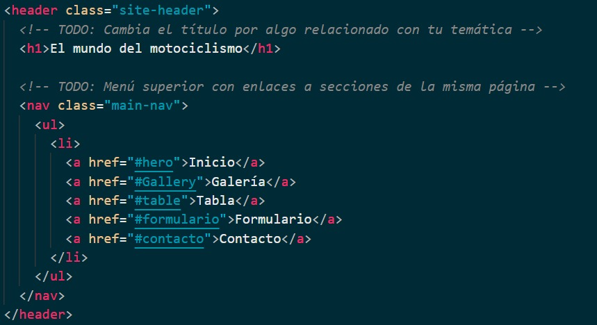
- En el main incluye el resto de la pagina, lo que es el contenido, todo lo que contenga la pagina de contenido quitando el pie de pagina que va aparte.
- Los section van dentro del main y puede contener varios section "secciones", a continuacion pongo una de las que he yo he puesto para las imagenes con sus respectivo h2 indicando el titulo y el "figure" dentro de un "div (caja)" que indica que el contenido es una imagen.
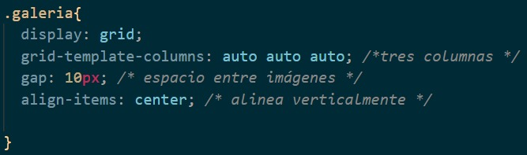
- En el footer, pie de pagina, he incluido un parra con su enlace que lleva al principio de la pagina al clickar en el y su respectivo texto.
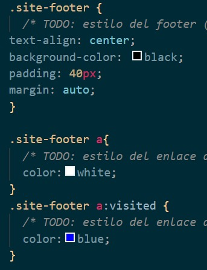
- En el menu superior podemos observar una lista desordenada "ul seguido de li" y dentro su respectiva informacion y enlaces que llevan a una zona de la pagina especific "href= #hero" por ejemplo.
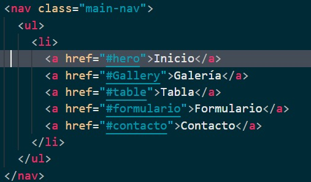
- En el menu lateral parrafos normales con el href que se comento arriba para que vaya al sitio especifico.  
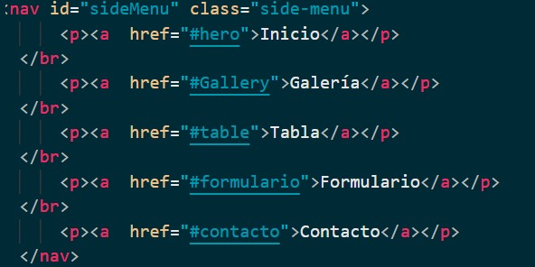
- El section son basicamente secciones que vas haciendo por cada apartado de la pagina, en el tengo incluida la historia del motociclismo
- En la tabla debemos utilizar "table" para crear la tabla, "thead" para la cabecera de la tabla con sus respectivos "tr" filas "th" encabezado y un "tbody" para su contenido con "tr" para filas y "td" para celda de datos de la fila.
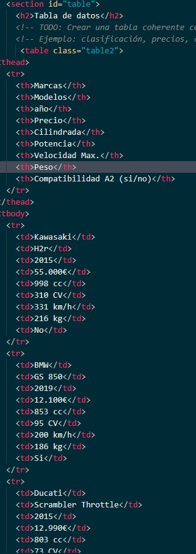
- En el formulario utilice "form" que es basicamente apra crear formulario, luego label para indicar lo que quiero poner y input para el tipo de dato a introducir, cosas que he utilizado dentro de input pues utilice lo siguiente "required" campo obligatorio, "maxlength" tamaño maximo de caracteres, y los huecos de ejemplo, es decir, que se vea un ejemplo de lo que hay que escribir en la casilla.
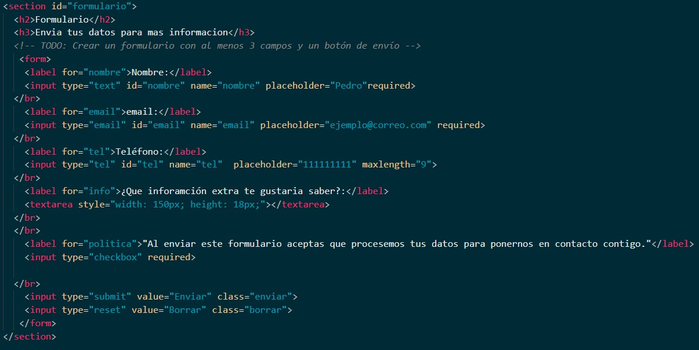
- En la galeria de imagenes dentro de su "figure" que se utiliza para mostrar que el contenido es una imagen y hay que crear uno por imagen.  
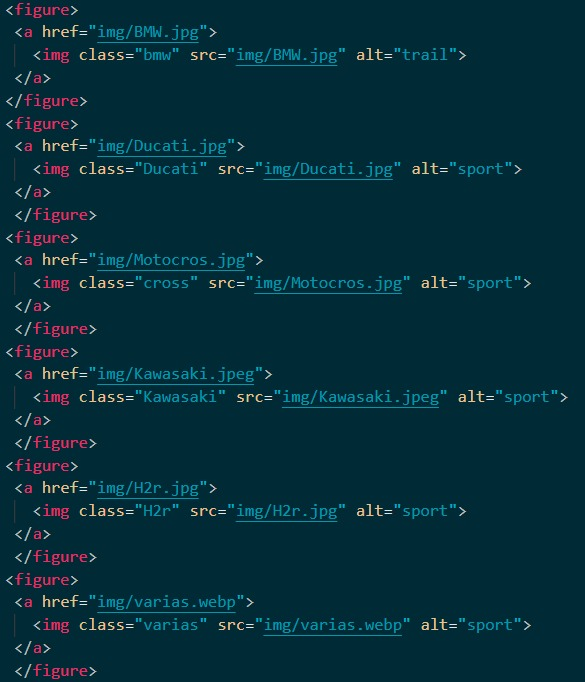
### 4.3. Evidencias de CSS
- Mis selectores utilizados son por ejemplo .gallery, que es un id para las imagenes, cosas del .main-nav, etc.
- En pseudoclases utilize a:hover, a:visited y a:focus, hover para que al pasar por encima se activa, el visited es como para cuando se visita algo por primera vez y el focus es para que cuando pulses sobre ele emento pues aparezca con una caja alrededor del color que le pongas  
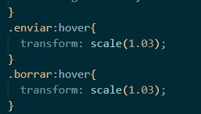
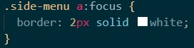
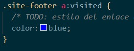
- Utilice flex ena parte para que el texto del menu superior se ponga horizontal, las listas en si y un grid para las imagenes, dejando un resultado de imagenes en 3 columnas y cada una con su espacio  
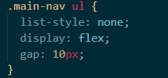
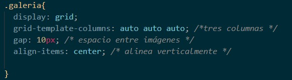
- Le puse box-shadow "sombra" a todas las imagenes
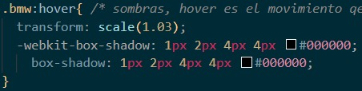
### 4.4. Fuentes utilizadas
- He utilizado la fuente local: LOUD
- y la online: AlfaSlabOne-Regular
- Me han gustado mucho estas tipografia porque el local le da un toque de grosor a los titulos y el online le da un estilo 3D a los textos de la cabecera y menu lateral, y es como llamativo ver eso.  
```css
@font-face {
  font-family: "Fuente LOUD";
  src: url("../AlfaSlabOne-Regular.ttf") format('truetype');
}   
h2{
  text-align: center;
  margin-top: 10px;
  font-family: "Fuente LOUD";
}  
h3{
  margin-top: 10px;
  font-family: "Fuente LOUD";
}
<link rel="preconnect" href="https://fonts.googleapis.com">
<link rel="preconnect" href="https://fonts.gstatic.com" crossorigin>
<link href="https://fonts.googleapis.com/css2?family=Bungee+Shade&display=swap" rel="stylesheet">
```  
### 4.5 Menu lateral: breve explicacion  

- Se abre y se cierra el menu y se cambia el icono.
- Pues la active que se desabilita cuando pulsas en el
- Asi se mueve  
.side-menu {
  position: fixed;
  top: 0;
  left: -230px;            /* oculto inicialmente */
  width: 230px;
  height: 100%;
  /* TODO: color de fondo, color de texto… */
  padding-top: 60px;
  transition: left 0.3s ease;
  z-index: 15;
  background-color: #f17f5d;
  color: white;
  padding-left: 20px;
}
### 4.6 Conclusion Personal
- He aprendido a utilizar el a:hover, a:visited y a:focus, el flex y grid, ha modificar cosas que estan dentro de algo especifico, cosas que estan seguidos de otras. Y he aprendido a pode rhacer una pagina web y subirla a remoto a git HUB
- Me gustaria mejorar en los conceptos grid, pero sobre todo flex que no lo he avabado de dominar
- La que mas me ha costado es la galeria de imagenes, ya que me costaba entender grid.
- La parte que me gusta mas sin duda es la historia que puse sobre el motociclismo, la segunda son las imagenes y la tercera la tabla.
